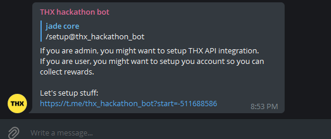
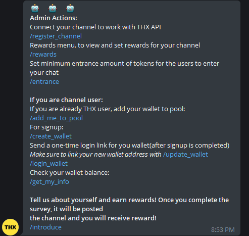

# THX Telegram Bot !
## CI and Tests

| CI Status: [](https://github.com/SHAKOTN/thx_tg_bot_contest/actions/workflows/main.yml) | Latest CI runs - [Link](https://github.com/SHAKOTN/thx_tg_bot_contest/actions)|
|---|---:

---

## What this bot is capable of doing?
This bot is built as an integration to [THX Network](https://www.thx.network).

Some of bot's features:
1. Admins of Telegram channels can invite bot to their channel and configure THX integration using `/register_channel` command
2. Admins can set reward for some specific actions users are doing `/rewards`
3. Admins can setup minimum entrance: `/entrance` amount of tokens to the channel. Those users who enter and don't have that amount will be kicked out
3. Users of telegram channels(that admins preconfigured) can signup, update their wallets and receive one-time login links to THX wallet app
4. Users of telegram channels can complete Know Your User survey and receive one time rewards by completing it.

## How to setup your telegram group to use THX bot
1. Invite THX Bot to your group and give it admin rights
2. Hit `/setup` command and you will see this message with a link to the bot:


This is how you contextualize bot usage and how you let bot know what channel you are configuring
3. After that you will be redirected to bot and will see a list of commands like this:


4. Hit `register_channel` and fill all information asked by copypasting addresses and secrets from your THX pool dashboard
5. After that you have two options: you can enable rewards for users who introduced themselves in a group or setup a minimum entrance balance. 
You can even configure to use both of these features at the same time
   
## How to setup bot is you are group user
1. Hit `/setup` command and you will see message as from above
2. Redirect to the bot private channel
3. Now you have two options:
    - You either create a new THX wallet for youself by hitting `/create_wallet`
    - Or hit `/add_me_to_pool` and fill up your existing THX wallet address
    
4. You are all set and you can start receiving rewards


## Security
In this project security was taken as a first priority. 
All bot commands are wrapped into valitador-decorator functions that are checking if user or admin are signed in, if channel is properly configured or if user has given a reward already, so they cannot spam rewards infinitely.

All settings and setups are happening in bot private chat that keeps certain context for the channel that you was redirected from. There is no way you can trick the bot by trying to acquire rewards for the channel that you are not member of.


## Setting things up
To run this bot locally:
1. Talk to [Botfather](https://t.me/botfather) and register your new bot. After everything is done, Botfather will give you bot token
2. Create .env file in project root and fill following ENV variables: `BOT_TOKEN` with token that you received from Botfather during step1; `MONGODB_USERNAME`, `MONGODB_PASSWORD` and `MONGODB_HOSTNAME`; `SECRET_KEY` that can be generated using `cryptography.Fernet`. Example of .env file:
```BOT_TOKEN=<BOT_TOKEN>
MONGODB_DATABASE=thx_integration
MONGODB_USERNAME=root
MONGODB_PASSWORD=my_pwd
MONGODB_HOSTNAME=mongodb
SECRET_KEY=<SECRET_KEY>
```
3. Run `docker-compose build`
4. Run `docker-compose up`

You are all set!
